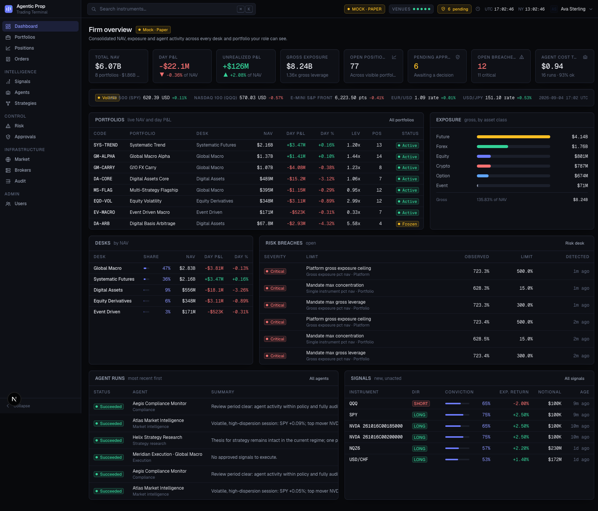

# Agentic Prop

An AI-native, agent-first proprietary trading platform, fully mocked end to end.
Trades options on Interactive Brokers, forex on Oanda, futures on Tradovate,
crypto on Coinbase and event contracts on Kalshi, with LLM agents running the
research → signal → sizing → execution → risk → compliance loop under human
supervision and four-eyes approvals.

See `docs/architecture.md` for the design.



## Prerequisites

- Node 20.9+, pnpm 11
- Neo4j 5+/2026.x reachable at `NEO4J_URI` with databases `agenticprop` and `agenticproptest` (see `.env.example`).
  If it runs in Docker and the API returns "Failed to connect to server", start the container (`docker start neo4j`).
- For end-to-end tests only: `npx playwright install chromium`

## Quick start

```bash
pnpm install
cp .env.example .env.local        # adjust credentials if needed
pnpm db:schema                    # constraints + indexes
pnpm db:seed                      # deterministic mock dataset (use --reset to wipe first)
pnpm dev                          # http://localhost:3001
```

Sign in on `/login` by picking a seeded user. `admin@agenticprop.io` is the global admin.

## Scripts

| Script | Purpose |
| --- | --- |
| `pnpm dev` / `pnpm build` / `pnpm start` | Next.js on port 3001 |
| `pnpm typecheck` / `pnpm lint` | `tsc --noEmit`, ESLint |
| `pnpm test` | Vitest: unit + integration (integration uses `NEO4J_TEST_DATABASE`) |
| `pnpm test:unit` / `pnpm test:integration` | Subsets |
| `pnpm test:e2e` | Playwright against the running dev server |
| `pnpm db:schema` / `pnpm db:seed` / `pnpm db:reset` / `pnpm db:reset:seed` | Database lifecycle |
| `pnpm check` | typecheck + lint + tests |

## Environment

| Variable | Default | Notes |
| --- | --- | --- |
| `NEO4J_URI` | `bolt://localhost:7687` | |
| `NEO4J_USER` / `NEO4J_PASSWORD` | `neo4j` / `password123` | |
| `NEO4J_DATABASE` | `agenticprop` | dev database |
| `NEO4J_TEST_DATABASE` | `agenticproptest` | wiped by integration tests |
| `SESSION_SECRET` | dev value | HMAC key for the session cookie |
| `LLM_PROVIDER` | `mock` | `mock` or `anthropic` (requires `ANTHROPIC_API_KEY`) |
| `PERSISTENCE` | `neo4j` | `memory` runs the whole app against in-memory repositories |
| `BROKER_SEED` | `42` | seed for the deterministic market simulator |

## Layout

```
app/            routes (App Router) + app/api route handlers
components/     UI design system + feature components
lib/core        Result, errors, ids, clock, logger, DI container, tokens
lib/domain      entities + zod schemas
lib/auth        RBAC matrix, session tokens, current-user helpers
lib/db          Neo4j client + schema
lib/repositories interfaces, neo4j/, memory/
lib/brokers     broker adapters + market simulator
lib/llm         LLM gateway (mock / anthropic)
lib/agents      agent runtime, tools, definitions, orchestrator, AgentService
lib/services    application services
lib/seed        deterministic seed data
scripts/        db-schema, seed, reset
tests/          unit, integration, e2e, fixtures
```

## What is mocked, and what is not

Real: the domain model, RBAC, the order pipeline and its state machine, the pre-trade
risk engine, four-eyes approvals, position/cash/NAV accounting, the agent runtime and
its persisted step traces, the Neo4j graph, and every test.

Simulated: broker connectivity and fills (`lib/brokers`), market data (a seeded price
simulator), LLM inference (`MockLLMProvider`), and backtests. Each sits behind an
interface — `BrokerAdapter`, `LLMProvider` — so a real implementation drops in without
touching the layers above.

## Scale of the seeded dataset

9 roles · 16 users · 5 desks · 87 instruments across 6 asset classes · 8 portfolios
(~$6.1B NAV) · 15 broker accounts · 80 positions · 10 strategies · 16 agents · 40 agent
runs with 304 steps · 30 signals · 120 orders · 136 fills · 21 risk limits · 8 breaches
· 13 approvals · 164 audit events · 3,817 price bars.

## Verification

| Gate | Result |
| --- | --- |
| `pnpm typecheck` | clean |
| `pnpm lint` | clean |
| `pnpm test` | 501 passing (38 files) |
| `pnpm test:e2e` | 28 passing |
| `pnpm build` | 85 routes |
